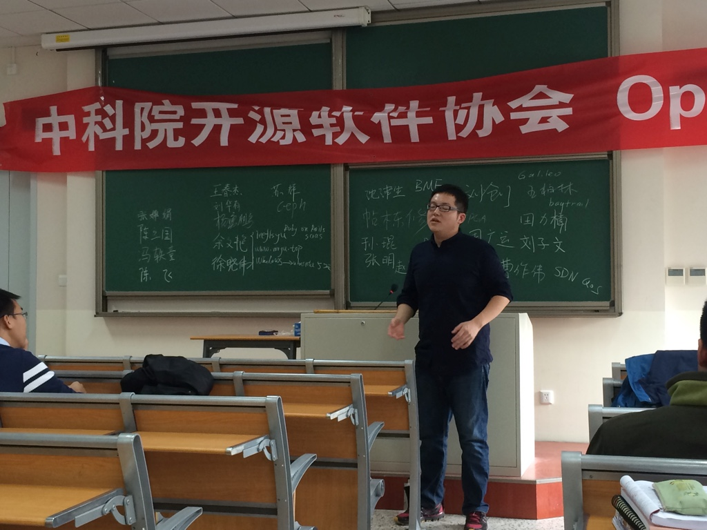
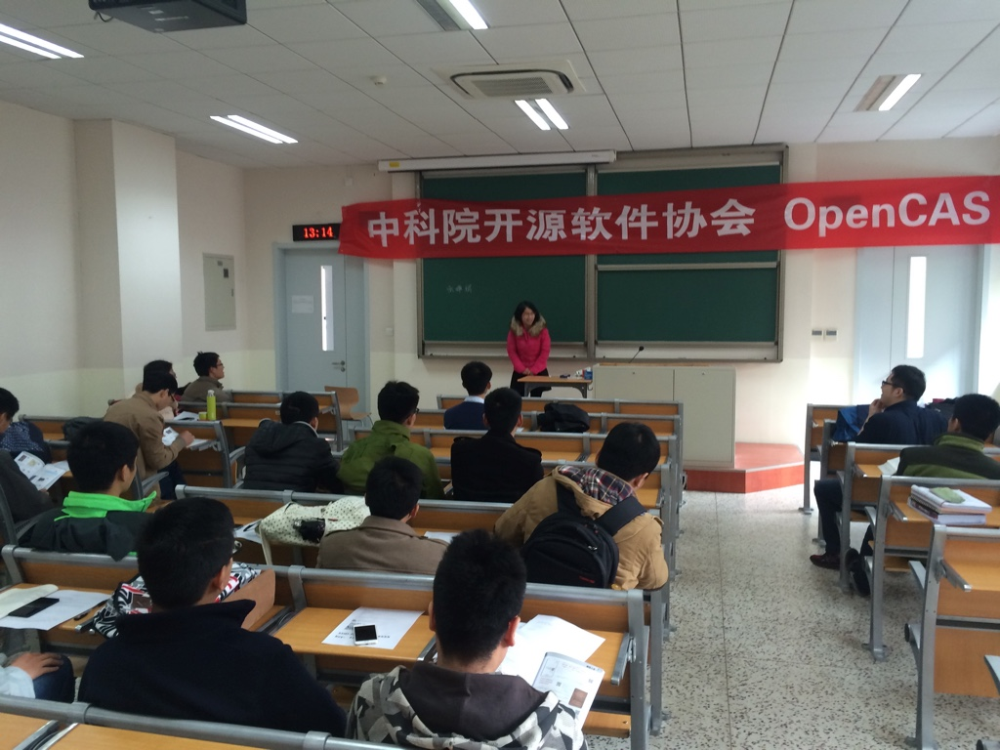
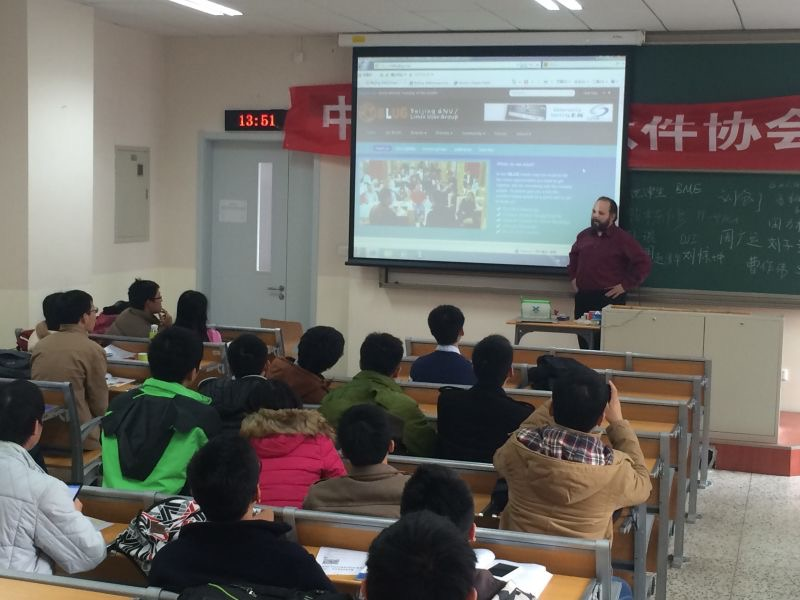
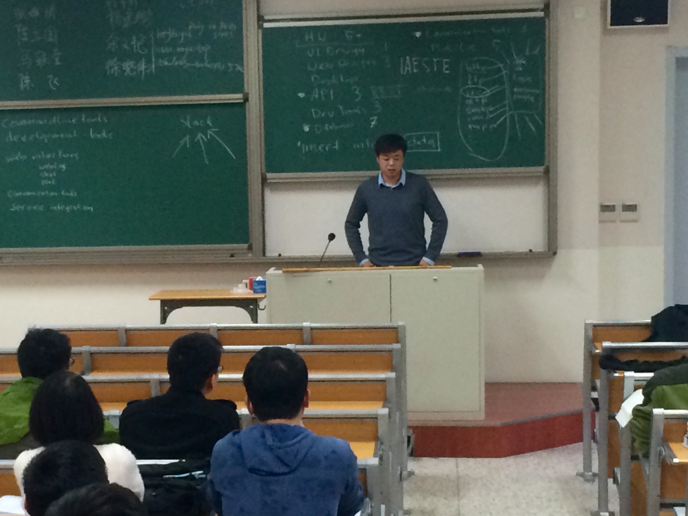
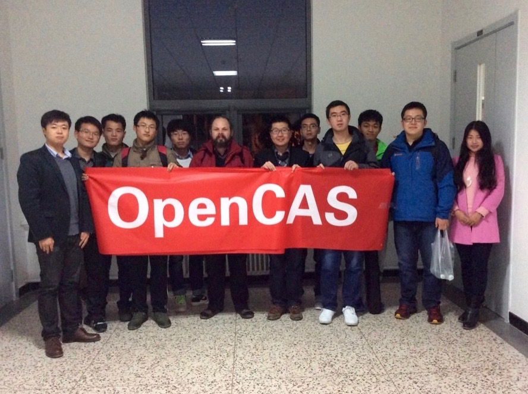

title: 中科院第一期『开源论坛』成功举办
category: Event
date: 2015-11-12
tags:
- 开源论坛
- 分享
thumbnail: openForum-6.jpg
lede: "为丰富同学们的校园生活，参与开源项目， Linux Story 社区携手中科院开源协会提供一批笔记本样机供同学们“折腾”"
featured: true
---

2015年11月8日13点—17点中科院开源软件协会OpenCAS在中科院雁栖湖校区开展了项目和技术交流活动。
首先，丁磊师兄简单介绍了此次交流活动的大致流程。并且，还介绍了这次活动邀请的北京Linux用户（BLUG）的主席Martin，和半导体所研三的黄涌师兄。

然后，开始此次活动的第一个环节即开源软件协会新成员自我介绍，让大家彼此认识，方便以后的交流。

其中，社团新成员还主要介绍了自己擅长的技术，以后的研究方向以及一些项目的想法等。同时，其他有想法的成员也可以随时与其进行讨论交流。

第二个环节是最热爱开源事业的BLUG的Martin给大家主要介绍了 BLUG ，societyserver项目，iaestechina出国实习项目等。同时，还详细解答了参加活动成员的相关疑问。

接下来第三个环节，黄涌师兄介绍了v6project开源项目的相关内容，展示了这个项目一些成果，以及这个项目的期望。介绍项目后，大家进行了热烈的讨论和亲身体验。

第四个环节，陈新宇师兄代表协会感谢了嘉宾并做了总结，并将图灵社区提供的两本图书赠送给到场的嘉宾

最后，活动圆满结束后大家集体合照留念。

感谢[图灵社区](http://www.ituring.com.cn)对此次活动的支持
