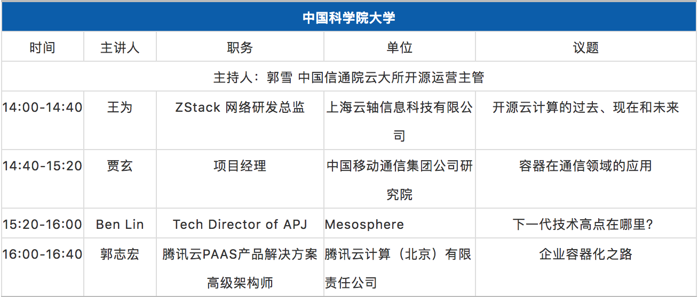

title: 中国信通院云技术开源技术公开课
ref: oscar_lecture
sponsor: OpenCAS x 中国信息通信研究院
guest: 王为、贾玄、Ben Lin、郭志宏
place: 雁栖湖 教一-113
time: 2017/05/12
start_time: 2018/05/15 14:00
end_time: 2018/05/15 16:00
event_url: 
wechat_url: https://mp.weixin.qq.com/s/67b3sW197u_Wp8f6rJSEpA
poster: poster.jpg
layout: events
---

> 一进入五月是不是感觉天气越发热了呢
> 别着急 更热的还在后头呢
> 备受瞩目的云计算开源技术公开课即将开讲啦

OSCAR携手清华大学、北京大学、中国科学院大学共同搭建桥梁，和三所高校的清华大学TUNA协会、北京大学开源软件协会、中国科学院大学开源软件协会（OpenCAS）合作，组织国内开源厂商将最新的开源技术带入高校，由一线的开发工程师结合实际开发经验讲解开源的热门技术。给热气腾腾的五月天又点了一把火。

一场云计算开源技术的饕餮盛宴即将开始，你准备好了吗？
请同学们耐心观看，千万不要错过自己心仪的“它”哦！

参加活动的小伙伴，此次活动整体安排非常紧凑，内容烧脑，大咖云集，保证每位参会者都收获满满，不虚此行。

另外 我们还有限量版的定制衣服、开源治理白皮书等专属礼品送你！数量有限，送完为止！所以没来现场的小伙伴可不止错过一丢丢哦！还在犹豫什么，赶紧提上日程，大佬带你开车。

联系人：李雅楠17604419190 liyanan@kexinyun.org