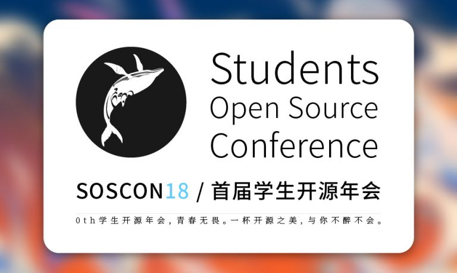

title: SOSCON18 学生开源年会
ref: soscon_2018
sponsor: SOSCON
guest: 
place: 重庆大学A区主教国际会议中心
time: 2017/05/13
start_time: 2018/06/09 00:00
end_time: 2018/06/10 23:59
event_url: https://openingsource.org/1859/
wechat_url: 
poster: poster.jpg
layout: events
---

学生开源年会（Students Open Source Conference）是中国大陆首个面向学生的开源大会，峰会基于开放源代码的理念，鼓励学生享受开源、了解开源、参与开源、贡献开源。峰会每年在不同城市轮流举办，从演讲者、组织者、志愿者到听众，绝大多数都为在校学生，包括中学生、大学生和研究生。

学生开源年会与台湾 SITCON、香港 SITCON HK 合为两岸华人社区三大面向学生的技术会议。旨在鼓励更多的学生了解和参与开源；也是中国大陆首届面向学生的开源会议，从演讲者到工作人员到听众几乎全部为学生，享受开源乐趣，参与开源贡献。关于畅想未来这件事情，我们学生更有感觉。

学生开源年会从2018年开始，每年在不同城市由不同高校社区举办一次，官方网站为 https://soscon.top 。包括招募演讲、招募志愿者在内的学生开源年会的最新消息，请访问官方网站或：
https://openingsource.org/special/soscon18/ (简体）；
https://openingsource.org/special/soscon18/zh-tw/（繁体）来获取。

> 身为学生的你有咩有觉得自己被捧在手心里——这不是针对毕业的叔叔阿姨们的大会，而是为青春飞扬、风华正茂、朝气蓬勃……的你定制的“套餐服务”啊！

#### 峰会主旨
希望引导和鼓励学生了解、参与、贡献开源；并且在开源项目中，结识更多的朋友，同时也让长期参与开源项目和认同开源理念的同学能够有交流技术、分享经验的机会。同时也欢迎到官方网站报名志愿者和演讲者。

#### 招募志愿者
希望引导和鼓励学生了解、参与、贡献开源；并且在开源项目中，结识更多的朋友，同时也让长期参与开源项目和认同开源理念的同学能够有交流技术、分享经验的机会。https://soscon.top/apply

#### 开放演讲提交
所有跟开源有关的话题和议题都是被鼓励的。包括：Linux、编程语言、云计算、人工智能等等；大会采取多轨道方式同时进行，涵盖但不限于以下内容，也非常欢迎随时跟我们分享你的新鲜想法。

- 学生自己做的开源项目分享。（譬如自己做的玩具项目、校园项目）
- 跟大学计算机、软件、网络相关的课程学习分享，譬如数据结构、操作系统等。（需与开源结合）
- 前沿领域的开源技术、开源项目分享，譬如最新的人工智能、区块链等。
- 自己参与的国际开源项目分享，譬如 Linux、GNOME、Python等等。
- 女性专场。（供女生参与及申请，与开源和计算机、软件相关的话题）
- Workshop 工作坊，手把手带你读源代码、带你折腾代码、或者贡献开源项目。
- 演讲者以学生为主，大会同时考虑对优秀的学生讲者进行一定的差旅补助，申请地址  https://soscon.top/apply

#### 征求赞助商
活动的举行离不开赞助商的支持，欢迎有意支持学生开源发展的公司与我们联络：soscon@openingsource.org

#### 时间地点
主办：开源工场
时间：2018年6月9日、10日
地点：重庆大学A区主教国际会议中心
官网：https://soscon.top

蒹葭苍苍，白露为霜；开源工场，在水一方。
欢迎关注学生开源年会，与你不醉不会

电报群：t.me/soscon
QQ群：202790710

Weibo：http://weibo.com/openingsource
Facebook：https://facebook.com/openingsource
Twitter：https://twitter.com/openingsource
Google +：https://google.com/+OpeningSource

